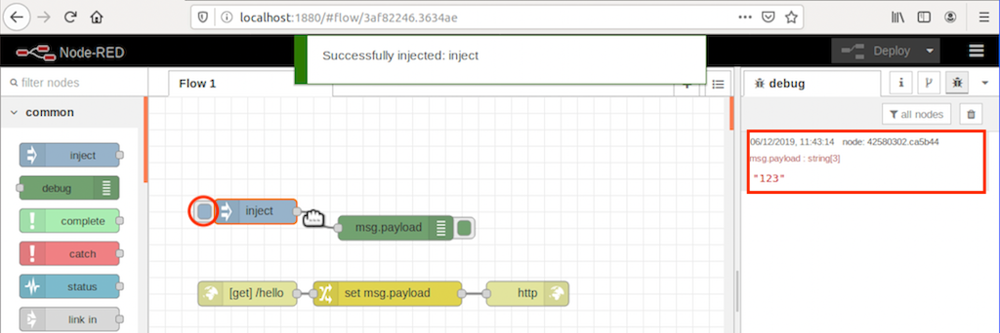
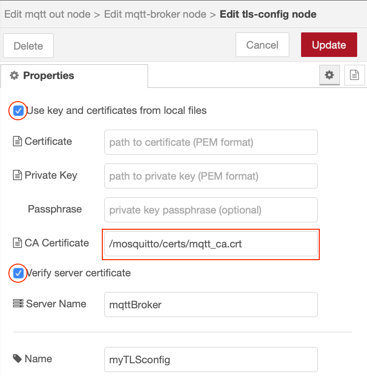
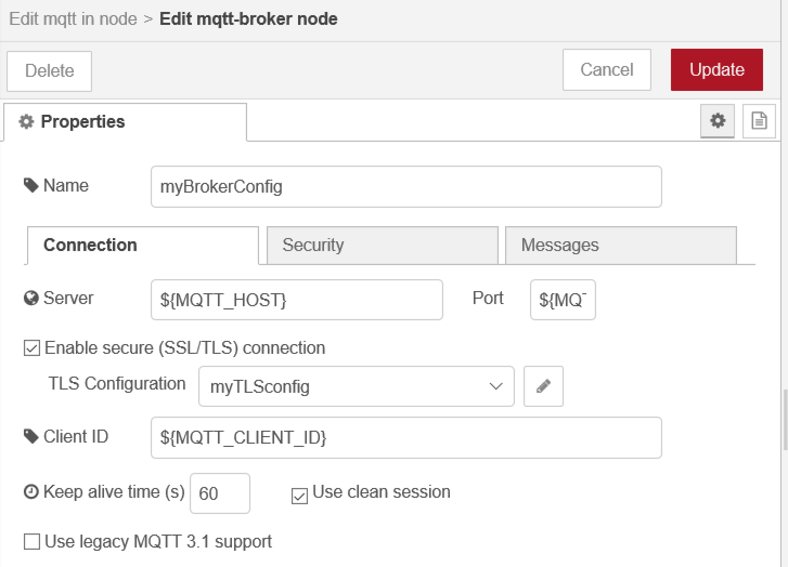

In this tutorial you will learn how to create Node-RED applications able to receive their configuration from the environment at runtime

## Learning objectives

In this tutorial, you will learn how to:

* get configuration for nodes from the environment
* access environment variables within a flow
* set environment variables when running a Docker container
* enable containers to communicate using a Docker user-defined bridge

The video below shows the instructor completing the tutorial, so you can watch and follow along, or skip the video and jump to the prerequisites section.

[](https://youtu.be/apKR3UhacWI "Demonstration of instructor completing this tutorial")

## Prerequisites

To complete this tutorial, you need:

* some experience of using Node-RED
* a laptop/workstation running an up to date version of Linux, Mac OS or Windows
* an up to date version of [Docker](https://www.docker.com) on your laptop/workstation (version 19.03 or higher should be returned by the `docker version` command)
* a [github](https://github.com) account
* [git tools](https://git-scm.com/downloads) installed on your laptop/workstation
* Completed tutorial **Package a Node-RED application in a container** and have the forked template repository in your github account, which is also cloned within a Node-RED project on your laptop/workstation

## Estimated time

You can complete this tutorial in less than 20 minutes.

## Steps

1. [Environment Variables](#step-1-environment-variables)
2. [Run a local broker](#step-2-run-a-local-broker)
3. [MQTT node config](#step-3-mqtt-node-config)
4. [Removing static config from nodes](#step-4-removing-static-config-from-nodes)
5. [Testing the environment variable substitution](#step-5-testing-the-environment-variable-substitution)
6. [Updating Docker container in dockerhub](#step-6-updating-docker-container-in-dockerhub)

Having configuration embedded in a container means that container is restricted to a single environment.  If a container application needs to connect to external services, such as a database or messaging service then allowing the configuration details for the external services to be provided at runtime makes the container much more useful, as it doesn't need to be rebuilt every time configuration changes.

The 12-factor app [Config](https://12factor.net/config) rule requires that config is stored in the environment.

Cloud runtime environments pass configuration to applications through a number of different mechanisms.  Setting environment variables is a common approach.

In Node-RED static configuration is usually found within the configuration properties of the nodes.  In the previous tutorial, when you enabled projects within the Node-RED editor you disabled configuration encryption, so it is easy to see the configuration, including the password configuration in the flows_cred.json file in the project directory.

### Step 1. Environment Variables

A number of nodes have the ability to access environment variables from their configuration, e.g. Inject node, Change node and Switch node.

It is also possible get a node configuration property to be replaced by an environment variable when the flow is loaded by using syntax **${ENV_VAR}** in any string based configuration property.

To set an environment variable named **WWW** in a command window:

* Linux and MacOS : `export WWW=123`
* Windows : `set WWW=123`

This sets the environment variable only for the current terminal or command window session.  There are ways on the different operating systems to set environment variables, so they are always set.

To see all environment variable that are set, simply enter command `set` on Linux, MacOS and Windows and you will see all the environment variables that are set.

Environment variables from the host are not automatically passed into a docker container.  You need to use the -e command line option to set an environment variable as part of the command line.  You can either provide a value for the environment variable on the command line or pass in the value from the local environment:

* `docker run -e WWW=987 ...` : will set the value 987 for environment variable **WWW** inside the container instance
* `docker run -e WWW ...` : will set the value for **WWW** from the local environment when the docker run command is executed.  If the **WWW** was set as above then the value in the container instance would be 123.  If there is no local environment variable set for **WWW** then the variable will not be set in the container

You can also use the **--env-file** option to read environment variables from a file:

`docker run --env-file env.list ...`

with file **env.list** containing

```text
# This line is a comment line
VAR1=abc
WWW
```

the **VAR1** environment variable would be set to *abc* and **WWW** would be set to the value of the local environment variable **WWW** when the docker command was run.

1. Stop any running Node-RED instances, then start Node-RED setting the WWW environment variable (If you have the Docker container from the previous tutorial still running then you need to stop that):

    * `docker stop dockerNR`
    * `docker rm dockerNR`
    * `docker stop mynodered`
    * `docker rm mynodered`
    * choose the appropriate command for your operating system (replacing *YOUR-USERNAME* with your own username):
      * **Windows**:

          `docker run -itd -p 1880:1880 -v c:\Users\YOUR-USERNAME\NRdata:/data -e NODE_RED_ENABLE_PROJECTS=true -e WWW=123 --name mynodered nodered/node-red`

      * **Mac OS**:

          `docker run -itd -p 1880:1880 -v /Users/YOUR-USERNAME/NRdata:/data -e NODE_RED_ENABLE_PROJECTS=true -e WWW=123 --name mynodered nodered/node-red`

      * **Linux**:

          `docker run -itd -p 1880:1880 -v /home/YOUR-USERNAME/NRdata:/data -e NODE_RED_ENABLE_PROJECTS=true -e WWW=123 --name mynodered nodered/node-red`

2. Modify the inject node you added in the **Node-RED with source control** tutorial to set the payload to the value of the **WWW** environment variable

    

    Deploy the change then test the outcome by pressing the button on the Inject node to send a message.  Switch to the debug tab to see the outcome

    

3. Modify the inject node configuration to inject a string and set the string value to **${WWW}** which produces the same result as using the env variable setting:

    

    Test the outcome by deploying the change, then press the button on the inject node - the output should be the same as the previous output, showing environment variable substitution.

### Step 2. Run a local broker

1. You need a clone a git repository to your local system so you can access the SSL certificates we will use for the rest of this tutorial:

    ```git clone https://github.com/binnes/moreNodeRedWorkshop.git```

    or if using ssh keys with GitHub:
  
    ```git clone git@github.com:binnes/moreNodeRedWorkshop.git```

2. Add a docker network bridge to allow the Node-RED container to find the MQTT broker container.  A user-defined network bridge allows containers connected to the same bridge to communicate, without exporting ports and also provides automatic name resolution using the --name parameter provided at container start:

    ```docker network create NRbridge```

3. Start the MQTT Mosquitto container:

    ```docker run -itd -p 8883:8883 -v <full path to where moreNodeREDWorkshop repo cloned>/moreNodeRedWorkshop/en/part5/broker:/mosquitto --network NRbridge --name mqttBroker eclipse-mosquitto```

    replace the `<full path to where moreNodeREDWorkshop repo cloned>` with the **fully qualified path** of the directory containing the git repository.

    e.g. On windows, if I cloned the repository into my home directory **c:\Users\brian** then the command would be:

    ```docker run -itd -p 8883:8883 -v c:\Users\brian\moreNodeRedWorkshop\en\part5\broker:/mosquitto --network NRbridge --name mqttBroker eclipse-mosquitto```

    On Mac or Linux, if I cloned the repository into home directory **/Users/brian** then the command would be:

    ```docker run -itd -p 8883:8883 -v /Users/brian/moreNodeRedWorkshop/en/part5/broker:/mosquitto --network NRbridge --name mqttBroker eclipse-mosquitto```

    *Note:* The -p option is passed here to export port 8883.  This exposes the MQTT broker port 8883 as if it were installed directly onto your laptop or workstation.  If you only want the services of the MQTT broker to be available to other containers connected to the NRbridge network, then you can omit the -p 8883:8883 from the command line.

4. (OPTIONAL) If you want to create additional broker users in the container.  There is already a default user created, the username is **mosquitto** with password **passw0rd**:

    ```docker exec mqttBroker mosquitto_passwd -b /mosquitto/config/passwd username userpassword```

    replacing *username* and *userpassword* as required

5. If you want to watch the mosquitto logs you can with command:

    ```docker logs -f mqttBroker```

    Press and hold the Control key, then press C (Ctrl-C) to exit following the mqtt broker logs

### Step 3. MQTT node config

In this section you will add some additional nodes to Node-RED, which connect to your local MQTT broker.

1. Restart the Node-RED service on your system.  To connect to the broker the Node-RED container need access to the broker certificates, so we will map the same volume as we did when starting the broker, as the certificates are in a cert sub-directory.  We also need to add the --network option to put the Node-RED container instance on the same Docker network bridge as the MQTT broker container instance.  

    `docker stop mynodered`  
    `docker rm mynodered`

    Now run the appropriate command for your operating system (replacing *YOUR-USERNAME* with your own username):
      * **Windows**:

          `docker run -itd -p 1880:1880 -v c:\Users\YOUR-USERNAME\NRdata:/data -e NODE_RED_ENABLE_PROJECTS=true -v <full path to where moreNodeREDWorkshop repo cloned>\moreNodeRedWorkshop\en\part5\broker:/mosquitto --network NRbridge --name mynodered nodered/node-red`

      * **Mac OS**:

          `docker run -itd -p 1880:1880 -v /Users/YOUR-USERNAME/NRdata:/data -e NODE_RED_ENABLE_PROJECTS=true -v <full path to where moreNodeREDWorkshop repo cloned>/moreNodeRedWorkshop/en/part5/broker:/mosquitto --network NRbridge --name mynodered nodered/node-red`

      * **Linux**:

          `docker run -itd -p 1880:1880 -v /home/YOUR-USERNAME/NRdata:/data -e NODE_RED_ENABLE_PROJECTS=true -v <full path to where moreNodeREDWorkshop repo cloned>/moreNodeRedWorkshop/en/part5/broker:/mosquitto --network NRbridge --name mynodered nodered/node-red`

    e.g. on mac, logged in as user brian, the command might look like:

    `docker run -itd -p 1880:1880 -v /Users/brian/NRdata:/data -e NODE_RED_ENABLE_PROJECTS=true -v /Users/brian/moreNodeRedWorkshop/en/part5/broker:/mosquitto --network NRbridge --name mynodered nodered/node-red`

2. Import the following flow (using the same technique used in the previous tutorial - **menu** -> **import**):

    ```JSON
    [{"id":"8381a5c3.3cbf9","type":"mqtt in","z":"3af82246.3634ae","name":"","topic":"#","qos":"2","datatype":"json","broker":"d2a17e7.00b668","x":90,"y":660,"wires":[["ebab6856.8901c"]]},{"id":"ebab6856.8901c","type":"debug","z":"3af82246.3634ae","name":"","active":true,"tosidebar":true,"console":true,"tostatus":false,"complete":"true","targetType":"full","x":410,"y":660,"wires":[]},{"id":"92d9d4a9.e5cf4","type":"inject","z":"3af82246.3634ae","name":"","topic":"","payload":"","payloadType":"str","repeat":"10","crontab":"","once":false,"onceDelay":0.1,"x":110,"y":540,"wires":[["fb7b0c12.eb2e48"]]},{"id":"fb7b0c12.eb2e48","type":"change","z":"3af82246.3634ae","name":"","rules":[{"t":"set","p":"payload","pt":"msg","to":"{ \"time\" : $fromMillis($toMillis($now()),'[H]:[m]:[s]') }","tot":"jsonata"}],"action":"","property":"","from":"","to":"","reg":false,"x":260,"y":560,"wires":[["d356084b.b81818"]]},{"id":"d356084b.b81818","type":"mqtt out","z":"3af82246.3634ae","name":"","topic":"time","qos":"","retain":"","broker":"d2a17e7.00b668","x":410,"y":580,"wires":[]},{"id":"d2a17e7.00b668","type":"mqtt-broker","z":"","name":"myBrokerConfig","broker":"mqttBroker","port":"8883","tls":"9ec473ef.e0678","clientid":"nodered","usetls":true,"compatmode":false,"keepalive":"60","cleansession":true,"birthTopic":"","birthQos":"0","birthRetain":"false","birthPayload":"","closeTopic":"","closeQos":"0","closeRetain":"false","closePayload":"","willTopic":"","willQos":"0","willRetain":"false","willPayload":""},{"id":"9ec473ef.e0678","type":"tls-config","z":"","name":"myTLSconfig","cert":"","key":"","ca":"/mosquitto/certs/mqtt_ca.crt","certname":"","keyname":"","caname":"","servername":"mqttBroker","verifyservercert":true}]
    ```

3. Open up the configuration of either of the mqtt nodes and select the edit icon next to the MQTT server config 
4. Switch to the **Security** tab and enter the MQTT broker credentials.  The default credentials are **mosquitto** / **passw0rd** 
5. Switch to the **Connection** tab and open the TLS Configuration 
6. The root certificate information should be already populated.  The certificate is read from the imported volume Docker mapped to the /mosquitto path 
7. Press the update and Done buttons to save the configuration, then Deploy the flow. You should see the MQTT nodes connected to your mqtt broker 

The sample application publishes the time to the configured MQTT broker every 10 seconds.  The second MQTT node subscribes to all topics (using # wildcard), so will receive all messages published by the first node.  It simply writes out the received message to the debug panel and also the system console (which makes the messages visible in the logs, which can be accessed using `docker logs -f mynodered` command)

### Step 4. Removing static config from nodes

To prevent config being captured in a flow you can replace all configuration of nodes by environment variables, so at run time the environment can provide the configuration to a flow, rather than the configuration being trapped in the flow.  This works for all string based values (including passwords).

1. Open up the server config and make the following changes on the Connection tab:
    * set the Server to ${MQTT_HOST}
    * set the Port to ${MQTT_PORT}
    * set the Client ID to ${MQTT_CLIENT_ID}
2. Switch to the Security tab:
    * set the Username to ${MQTT_USER}
    * set the Password to ${MQTT_PWD} (you won't be able to see this, as the password field hides the content)
3. Switch back to the Connection tab and open the TLS config editor
    * set the CA Certificate to ${MQTT_CA_CERT}
    * set the Server name to ${MQTT_HOST}
4. Press Update and Done to close the config panels then Deploy the flow.

This is what the config should now look like:
  and the resultant flow file segment :

```JSON
  {
      "id": "7a44476d.a179c8",
      "type": "mqtt-broker",
      "z": "",
      "name": "myBrokerConfig",
      "broker": "${MQTT_HOST}",
      "port": "${MQTT_PORT}",
      "tls": "850bd469.ceb218",
      "clientid": "${MQTT_CLIENT_ID}",
      "usetls": true,
      "compatmode": false,
      "keepalive": "60",
      "cleansession": true,
      "birthTopic": "",
      "birthQos": "0",
      "birthRetain": "false",
      "birthPayload": "",
      "closeTopic": "",
      "closeQos": "0",
      "closeRetain": "false",
      "closePayload": "",
      "willTopic": "",
      "willQos": "0",
      "willRetain": "false",
      "willPayload": ""
  },
  {
      "id": "850bd469.ceb218",
      "type": "tls-config",
      "z": "",
      "name": "myTLSconfig",
      "cert": "",
      "key": "",
      "ca": "${MQTT_CA_CERT}",
      "certname": "",
      "keyname": "",
      "caname": "",
      "servername": "${MQTT_HOST}",
      "verifyservercert": true
  },
```

and flow credentials file:

```JSON
{
    "7a44476d.a179c8": {
        "user": "${MQTT_USER}",
        "password": "${MQTT_PWD}"
    },
    "850bd469.ceb218": {}
}
```

You can see the environment variables, which will be substituted at runtime for the values contained in the environment variables.

### Step 5. Testing the environment variable substitution

If you were running locally you would need to set the environment variables before Node-RED is started, so they are available when Node-RED loads and runs the flow.  However, as we are running from a container we need to provide the environment variables as the container is started.

As there are quite a few environment variables that need to be set, so we will switch to reading the environment variables from a file.

1. In a command or terminal window, ensure the current working directory is your Node-RED project directory (`cd [user home directory]/NRdata/projects/Node-RED-Docker`)
2. Create a new file called env.list in your project directory
3. Add the following to the env.list file:

    ```text
    NODE_RED_ENABLE_PROJECTS=true
    MQTT_CLIENT_ID=nodeRED
    MQTT_HOST=mqttBroker
    MQTT_PORT=8883
    MQTT_USER=mosquitto
    MQTT_PWD=passw0rd
    MQTT_CA_CERT=/mosquitto/certs/mqtt_ca.crt
    WWW=123
    ```

4. Restart Node-RED:  
    * `docker stop mynodered`
    * `docker rm mynodered`
    * Run the appropriate command for your operating system (replacing *YOUR-USERNAME* with your own username):
      * **Windows**:

          `docker run -itd -p 1880:1880 --env-file env.list -v c:\Users\YOUR-USERNAME\NRdata:/data -v c:\<full path to where moreNodeREDWorkshop repo cloned>\moreNodeRedWorkshop\en\part5\broker:/mosquitto --network NRbridge --name mynodered nodered/node-red`
      * **Mac OS**:

          `docker run -itd -p 1880:1880 --env-file env.list -v /Users/YOUR-USERNAME/NRdata:/data -v <full path to where moreNodeREDWorkshop repo cloned>/moreNodeRedWorkshop/en/part5/broker:/mosquitto --network NRbridge --name mynodered nodered/node-red`
      * **Linux**:

          `docker run -itd -p 1880:1880 --env-file env.list -v /home/YOUR-USERNAME/NRdata:/data -v <full path to where moreNodeREDWorkshop repo cloned>/moreNodeRedWorkshop/en/part5/broker:/mosquitto --network NRbridge --name mynodered nodered/node-red`

    e.g. on mac, logged in as user brian, the command might look like:

    `docker run -itd -p 1880:1880 --env-file env.list -v /Users/brian/NRdata:/data -v /Users/brian/moreNodeRedWorkshop/en/part5/broker:/mosquitto --network NRbridge --name mynodered nodered/node-red`

### Step 6. Updating Docker container in dockerhub

To create a containerised version of the latest version of the Node-RED application you need to rebuild and push the updated Node-RED application.

1. Go to the GitHub integration tab in the Node-RED editor and commit and push the latest version of your flow
2. Ensuring you are in the project directory in a command or terminal window, build the container with the command (replace YOUR-DOCKER-USERNAME with your docker username):

    `docker buildx build --platform linux/amd64,linux/arm64,linux/arm/v7 -t YOUR-DOCKER-USERNAME/node-red-docker-sample --push .`

3. Stop the existing Node-RED docker instance and remove it.  You cannot have 2 instances of a Docker container with the same name, so if the previous instance of the dockerNR container still exists, then you need to remove it before you can deploy a new instance:  
    * `docker stop mynodered`
    * `docker rm mynodered`
    * `docker rm dockerNR`
4. Pull the container image from dockerhub to ensure you have the latest version locally (replace YOUR-DOCKER-USERNAME with your docker username):

    `docker pull YOUR-DOCKER-USERNAME/node-red-docker-sample:latest`

5. Run the new container.  For docker you can use the **--env-file** option to pass in environment variables using the env.list file created for the previous step.  This time we will use a fully qualified path to the file, so you don't need to be in the directory containing the env.list file.  Start your containerised Node-RED application.  You also need the container on the NRbridge network bridge to be able to access the MQTT broker container (replace the path to the moreNodeRedWorkshop directory and YOUR-DOCKER-USERNAME with your docker username):
    * **Windows**:

        `docker run -dit --env-file c:\Users\YOUR-USERNAME\NRdata\projects\Node-RED-Docker\env.list -v c:\<full path to where moreNodeREDWorkshop repo cloned>\moreNodeRedWorkshop\en\part5\broker:/mosquitto -p 1880:1880 --network NRbridge --name dockerNR YOUR-DOCKER-USERNAME/node-red-docker-sample:latest`

    * **Mac OS**:

        `docker run -dit --env-file /Users/YOUR-USERNAME/NRdata/projects/Node-RED-Docker/env.list -v <full path to where moreNodeREDWorkshop repo cloned>/moreNodeRedWorkshop/en/part5/broker:/mosquitto -p 1880:1880 --network NRbridge --name dockerNR YOUR-DOCKER-USERNAME/node-red-docker-sample:latest`

    * **Linux**:

        `docker run -dit --env-file /home/YOUR-USERNAME/NRdata/projects/Node-RED-Docker/env.list -v <full path to where moreNodeREDWorkshop repo cloned>/moreNodeRedWorkshop/en/part5/broker:/mosquitto -p 1880:1880 --network NRbridge --name dockerNR YOUR-DOCKER-USERNAME/node-red-docker-sample:latest`

    Notice:

    * you need to provide the values for content in brackets in the above command : **< >**
    * all the environment variables are set with the **--env-file** option and the env.list file
    * the directory containing the certificates is mapped to a local directory **/mosquitto** within the container using the **-v** option.  The **MQTT_CA_CERT** environment variable references the root certificate authority certificate from within this directory.
    * The containers are able to communicate and find each other as they are using the user-defined bridge **NRbridge** using the **--network** option and the **--name** option to name the container instance and enable the container name resolution.  The **MQTT_HOST** environment variable is set to **mqttBroker**, so requires the MQTT container to be named **mqttBroker**.

## Summary

In this tutorial you:

* learned how to access environment variables in Node-RED
* replaced node config setting with environment variables
* set environment variables when creating a Docker container
* how to get docker containers to communicate using a Docker user-defined bridge

In this tutorial we used the Docker command line to run containers, but there are higher level services, which make managing containers and their configuration more robust and scaleable, such as Kubernetes.
