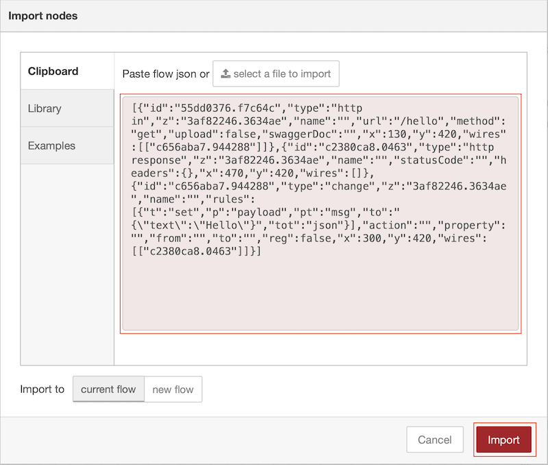

In this tutorial you will learn how to package a Node-RED application into a container and customise the runtime for production running rather than application creation

## Learning objectives

In this tutorial, you will learn how to:

* Identify the dependencies for a Node-RED application
* Customise the Node-RED runtime for production use
* Build a multi-architecture container for a Node-RED application and push it to a container registry
* Run a containerised Node-RED application

## Prerequisites

To complete this tutorial, you need:

* some experience of using Node-RED
* a laptop/workstation running an up to date version of Linux, Mac OS or Windows
* an up to date version of [Docker](https://www.docker.com) on your laptop/workstation (version 19.03 or higher should be returned by the `docker version` command)
* a [github](https://github.com) account
* [git tools](https://git-scm.com/downloads) installed on your laptop/workstation
* Completed tutorial **Node-RED with source control** and have the forked template repository in your github account, which is also cloned within a Node-RED project on your laptop/workstation

## Estimated time

You can complete this tutorial in less than 20 minutes.

## Steps

1. [Dependencies](#step-1-dependencies)
2. [Extend application](#step-2-extend-the-application)
3. [Build the application](#step-3-configure-the-builder-and-build-the-application)

### Step 1. Dependencies

Containers are becoming the standard way to package, distribute and deploy applications for modern cloud based environments.  Increasingly containers are also being used to distribute and manage workloads in edge of network scenarios.

X86_64 is the predominant CPU architecture in use today in public cloud, but there are also Open Power and S390 systems being used in infrastructures running many large businesses.  At the edge there are also ARM32 and ARM64 systems, so in this tutorial you will build a multi-architecture container, allowing your containers to run on multiple different architectures.

The 12-factor app [dependency rule](https://12factor.net/dependencies) is to *Explicitly declare and isolate dependencies*

For a Node-RED application all dependencies are specified in the package.json file.  When adding additional nodes to the Node-RED pallet, ensure they are added to the package.json.

However, there are still '*hidden*' dependencies that can creep into a project when a package has some native dependencies that need to be installed in the host system running the application.

To get round this the starter project has a Dockerfile which will build the application from the source code and package it into a container.  The Dockerfile captures all *hidden* dependencies.

The provided Dockerfile in the starter project initially creates a build container to build the required software, then creates an applications image, copying built content from the build container.  This way a fully defined build environment is created and used, but the build tooling is not part of the production container image.

The runtime files in the starter project have been modified to allow the application to be better managed in the cloud.  Additional endpoints (*/live, /ready and /health*) have been added to allow a cloud environment to verify the state of the running container.  The editor has also been moved to the **/admin** endpoint.  In a production environment the editor should be disabled, but for this tutorial it has been left active to allow you to examine the Node-RED runtime running in the container.

In this tutorial the new **buildx** Docker feature is used to make it easier to create and push multi-architecture containers.

### Step 2. Extend the application

Before building the app we will add another few nodes to add a Web endpoint, so we can test an app when we have Node-RED deployed in Docker.

1. Start Node-RED, if not already running:
    * run `docker ps -a` to see what is running
    * if **mynodered** container instance exists, but is not in state **up**, then run command `docker start mynodered`
    * if **mynodered** container instance does not exist then run the appropriate command (replacing *YOUR-USERNAME* with your own username):
      * **Windows**:  
          `docker run -itd -p 1880:1880 -v c:\Users\YOUR-USERNAME\NRdata:/data -e NODE_RED_ENABLE_PROJECTS=true --name mynodered nodered/node-red`
      * **Mac OS**:  
          `docker run -itd -p 1880:1880 -v /Users/YOUR-USERNAME/NRdata:/data -e NODE_RED_ENABLE_PROJECTS=true --name mynodered nodered/node-red`
      * **Linux**:  
          `docker run -itd -p 1880:1880 -v /home/YOUR-USERNAME/NRdata:/data -e NODE_RED_ENABLE_PROJECTS=true --name mynodered nodered/node-red`
2. Import the following JSON to add the **/hello** endpoint:

    * to import the flow select the main menu (☰), then the import option from the menu
        
    * copy and paste the JSON below into the Import nodes window, then press the **Import** button to import the nodes
        

      ```JSON
      [{"id":"55dd0376.f7c64c","type":"http in","z":"3af82246.3634ae","name":"","url":"/hello","method":"get","upload":false,"swaggerDoc":"","x":130,"y":420,"wires":[["c656aba7.944288"]]},{"id":"c2380ca8.0463","type":"http response","z":"3af82246.3634ae","name":"","statusCode":"","headers":{},"x":470,"y":420,"wires":[]},{"id":"c656aba7.944288","type":"change","z":"3af82246.3634ae","name":"","rules":[{"t":"set","p":"payload","pt":"msg","to":"{\"text\":\"Hello\"}","tot":"json"}],"action":"","property":"","from":"","to":"","reg":false,"x":300,"y":420,"wires":[["c2380ca8.0463"]]}]
      ```

    * press the **Deploy** button to make the new nodes live (you can now access the new endpoint running on your local Node-RED instance [http://localhost:1880/hello](http://localhost:1880/hello)

3. Commit and push the change to git
    * switch to the git side panel
    * stage the change to the flows.json
    * commit the change
    * switch to the Commit History section of the side panel
    * click the up arrow to open the Manage remote branch popup
    * push the change to the server

### Step 3. Configure the builder and build the application

In this tutorial we will use the new **buildx** feature of Docker.  At the time of writing this content it is an experimental feature in Docker, so experimental features need to be enabled in Docker to get access to buildx:

1. Enable buildx in Docker:
    * Linux
      * Environment variable **DOCKER_CLI_EXPERIMENTAL** should be set to **enabled**
      * To build multi-architecture images on Linux, architecture emulation needs to be added to Linux.  This can be done by running the following command:

          `docker run --rm --privileged docker/binfmt:66f9012c56a8316f9244ffd7622d7c21c1f6f28d`

    * MacOS and Windows
      * Start Docker if it is not running
      * Click the Docker icon (usually in bottom notification popup on Windows, top menu bar on MacOS) and select **settings** or **Preferences** then the **Command Line** section
      * Enable Experimental features
2. Open a command or terminal window then :
    * navigate to your home directory
    * navigate to the **NRdata/projects/Node-RED-Docker** subdirectory within your home directory. This directory should contain the Dockerfile.  
    You will use the new **docker buildx** command to build and push a multi-arch image to dockerhub.
3. Before you can build a container you need to create a new builder.  Enter the command:

    `docker buildx create --name NRbuilder --use`

4. Inspect the builder with command :

    `docker buildx inspect --bootstrap`

    which will also start the builder if it is not running.  The output of this command will show the target architectures supported by the builder.
5. You can check you have a builder running using the **ls** command, which also outputs the list of supported architectures :

    `docker buildx ls`

6. Now the builder is up and running you can build a multi-arch container and push it to your dockerhub account.  First ensure you are logged into dockerhub :

    `docker login`

7. Build and push the image :

    `docker buildx build --platform linux/amd64,linux/arm64,linux/arm/v7 -t YOUR-DOCKER-USERNAME/node-red-docker-sample --push .`

    replace **YOUR-DOCKER-USERNAME** with your docker username.  Here you see we are asking to build an image for 3 different architectures.  AMD/Intel 64 bit, ARM 64bit and ARM 32bit v7 (Raspberry Pi 3/4).  You can also add additional architectures, such as **linux/s390x** to add support for IBM Z systems or **linux/ppc64le** for IBM POWER systems.  Note the more architectures you select to build, the longer the build takes.
8. Inspect the image using command (replace **YOUR-DOCKER-USERNAME** with your docker username):

    `docker buildx imagetools inspect docker.io/YOUR-DOCKER-USERNAME/node-red-docker-sample:latest`

9. Stop your local Node-RED using command:

    `docker stop mynodered`

    in a command line window,  then run the container using command :

    `docker run -dit -p 1880:1880 --name dockerNR YOUR-DOCKER-USERNAME/node-red-docker-sample:latest`

10. Test your container.  
    * You will not be able to launch at the Editor on the base URL, as this has been modified in the sample project **settings.js** file.  The editor can be launched at [**/admin**](http://localhost:1880/admin).  In a production Node-RED container you should not be able to alter the application, so the editor needs to be disabled.  This can be achieved by setting the **httpAdminRoot** property in the **settings.js** file to **false**.  Details of the Node-RED configuration options can be found in the [Node-RED documentation](https://nodered.org/docs/user-guide/runtime/configuration).  
    * You should be able to access the [/hello](http://localhost:1880/hello) endpoint
11. If you have a Raspberry Pi or other ARM 32-bit or ARM 64-bit system you can also test that the ARM containers also work.

## Summary

In this tutorial you:

* Enabled experimental features in Docker to access the buildx command
* Created a new builder instance
* Created a multi-architecture set of containers and pushed them to dockerhub
* Inspected the created images
* Ran the newly created container on your local machine and optionally on a system with a different CPU architecture

Now you can create a Docker image containing your Node-RED application, but to make the container suitable for running in a cloud environment there is a further consideration needed to allow the cloud environment to provide configuration at runtime to the container, which is the subject of the [next tutorial](../Node-RED%20config%20from%20environment/README.md).
