# Node-RED Source Control

In this tutorial you will learn how to enable git integration in Node-RED.  Once git integration has been turned on you will learn how to use the git integration features within the Node-RED editor.

## Learning objectives

In this tutorial, you will learn how to:

* Enable Node-RED to work with git source control
* Use the git integration features of the Node-RED editor to
  * clone a git repository
  * commit and push changes to a git server
  * pull changes from a git server
  * resolve merge conflicts within the Node-RED editor

The video below shows the instructor completing the tutorial, so you can watch and follow along, or skip the video and jump to the prerequisites section.

[](https://youtu.be/ecrjDfZth-w "Demonstration of instructor completing this tutorial")

## Prerequisites

To complete this tutorial, you need:

* some experience of using Node-RED
* a laptop/workstation running an up to date version of Linux, Mac OS or Windows
* an up to date version of [Docker](https://www.docker.com) on your laptop/workstation (version 19.03 or higher should be returned by the `docker version` command)
  * Windows users need to ensure that Docker is using Linux containers.  This setting is available by right clicking the Docker icon in the status section of the Windows task bar, usually at the bottom of the screen.  You should see an option to switch to Windows containers.  If you have an option to switch to Linux containers, you need to select it as you are currently using windows based containers.  
  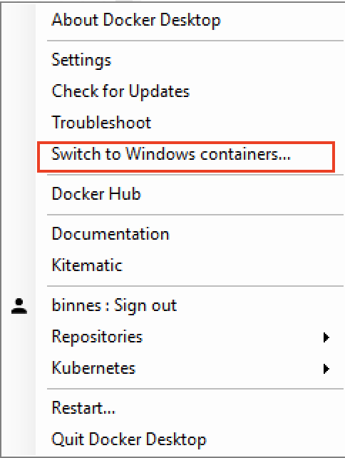{style="width: 25%" .center}
* a [github](https://github.com) account
* [git tools](https://git-scm.com/downloads) installed on your laptop/workstation

You will notice that a Node-RED installation is not a prerequisite.  In this tutorial all development is done using a Node-RED container.  Using a container ensures that all developers working on a project use a common Node-RED installation, with an '*approved*' set of Node.js packages installed in the container and nodes in the Node-RED pallet.

## Estimated time

You can complete this tutorial in less than 20 minutes.

## Steps

1. [Codebase](#step-1-codebase)
1. [Enable source control in Node-RED](#step-2-enable-source-control-in-node-red)
1. [Using Source control in Node-RED](#step-3-using-source-control-in-node-red)
1. [Pulling changes and handling merge conflicts](#step-4-pulling-changes-and-handling-merge-conflicts)

### Step 1. Codebase

When using Node-RED in production, you need to be able to work within a DevOps process, which relies on application source being managed by a source control system, such as git.

This is also a requirement when creating cloud native applications.  The first rule for 12-factor apps is [Codebase](https://12factor.net/codebase) - *One codebase tracked in revision control, many deploys*

First we need to decide what is a Node-RED application code base?

A Node-RED application is defined by a flow file and an optional credentials file.  However, the flow may require some additional nodes to be installed.  The flow runs within a Node.js application, which is the Node-RED runtime.  This runtime can be customised and configured, so to fully capture a Node-RED application code base you need to capture the :

* application flow and credential file
* the package.json file, which captures all required Node.js and Node-RED nodes needed by the flow
* the Node-RED runtime source files

For this workshop a [starter git project](https://github.com/binnes/Node-RED-Docker) has been provided, containing a Node-RED runtime, customised to be managed by a cloud.

We are using the public github service to work through this tutorial, but Node-RED works with any standard git service.  So after completing the tutorial you can choose your preferred  git service or you can setup your own git server to work on premises.

Follow the instructions to fork the starter git repository, which is contains a starter template for a new project.  This will create a repository in your own github account so you can make changes to the content.

1. Open a browser an navigate to the [git starter project repo](https://github.com/binnes/Node-RED-Docker)
2. Make sure you are logged into your github account then press the **Fork** button so you have your own copy of the repo 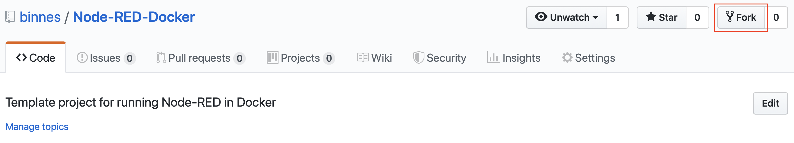
3. (OPTIONAL) If you have 2-factor authentication enabled on your github account, then you need to use a Personal Access Token when using the git command line tools.  To create a Personal Access Token:
    * Open the git settings  
  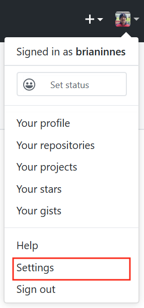{style="width: 20%" .center}
    * select **Developer settings** then **Personal access tokens** then **Generate new token**.
    * Give the token a use, select all scopes except `admin:enterprise` and `admin:gpg.key` scope then **Generate token** 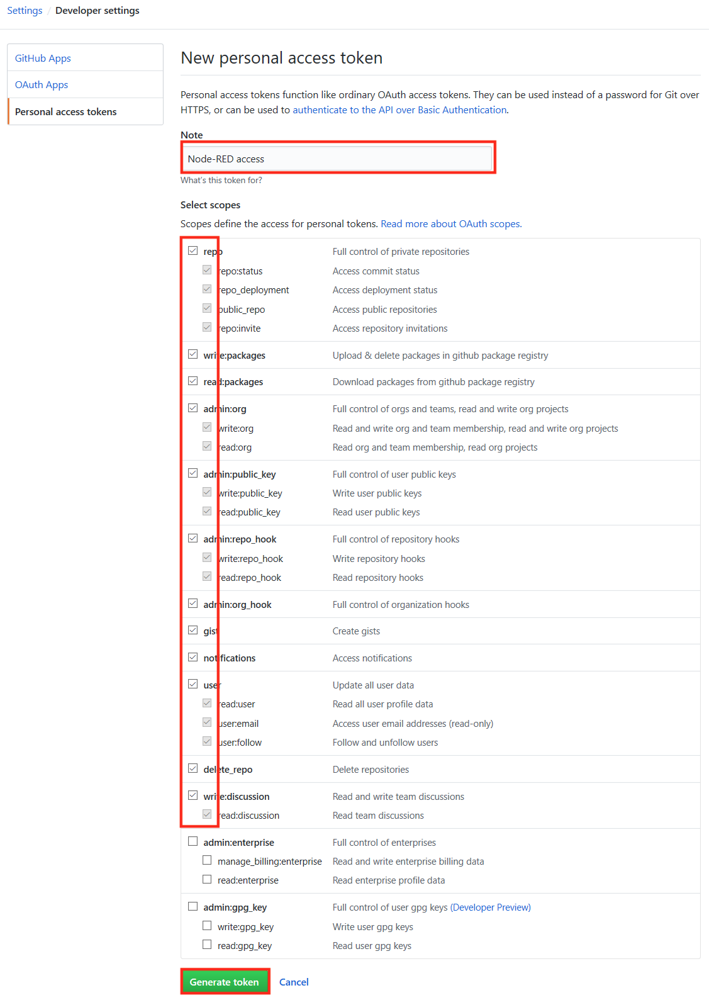 - record the token as you will need it later in the tutorial.

### Step 2. Enable Source control in Node-RED

Node-RED has the [**projects**](https://nodered.org/docs/user-guide/projects/) feature, which is turned off by default.  It allows Node-RED to work with a version control system to manage the Node-RED flow and associated content.

There are 2 ways of enabling projects in Node-RED:

* Update the settings.js file in the userDirectory for Node-RED (this is the .node-red folder in your home folder by default)
* Set the **NODE_RED_ENABLE_PROJECTS** environment variable before starting Node-RED

In this tutorial we will run Node-RED in a Docker image, this removes the need for a local install of Node.js and node-RED, but if you have Node-RED already installed and want to enable the projects feature, then you should edit the settings.js file:

  *On your system edit file .node-red/settings.js in your home directory.  At the bottom of the file change the projects setting to `enabled : true` 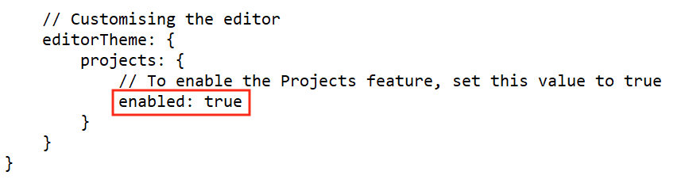*

Follow the instructions below to start Node-RED with the project feature enabled.  The commands need to be entered in a command or terminal window, running as your normal login user:

1. If Node-RED is already running on your system, stop it
2. Create a new directory called **NRdata** in your home directory to use as the Node-RED userDirectory:

    `mkdir NRdata`

    * *Note: on Linux the NRdata directory needs to be writeable by user with UID 1000.  If your user UID is not 1000 then make the directory writeable by everyone :*

      `chmod 777 NRdata`
  
3. To start Node-RED use command (select your operating system.  You will need to update the path to the NRdata directory):
    * **Windows**:

        `docker run -itd -p 1880:1880 -v c:\Users\YOUR-USERNAME\NRdata:/data -e NODE_RED_ENABLE_PROJECTS=true --name mynodered nodered/node-red`

    * **Mac OS**:  

        `docker run -itd -p 1880:1880 -v /Users/YOUR-USERNAME/NRdata:/data -e NODE_RED_ENABLE_PROJECTS=true --name mynodered nodered/node-red`

    * **Linux**:  

        `docker run -itd -p 1880:1880 -v /home/YOUR-USERNAME/NRdata:/data -e NODE_RED_ENABLE_PROJECTS=true --name mynodered nodered/node-red`

    Note:
      * the **-e** option is short for **--env** and sets the **NODE_RED_ENABLE_PROJECTS** environment variable
      * the **-v** option is short for **--volume** and maps your local **NRdata** directory into the container at location **/data**, which is configured as the userDirectory for Node-RED.
      * to see all the possible options for the Docker run command use ```docker run --help```

### Step 3. Using Source control in Node-RED

The git integration built into the projects feature of Node-RED will allow you to clone an existing git repository or create a new repository from within the Node-RED editor.  You will also find a new **Projects** entry in the main menu, where you can change the current project, create a new project or look at the current project settings.  Node-RED stores projects files in a directory called **projects** in your Node-RED user directory, this defaults to **.node-red/projects** in your home directory on your operating system.  Each projects is stored in its own directory within the projects directory.

For this tutorial the Node-RED user directory is the NRdata directory you created in the previous step, so you will find project directories in **NRdata/projects**.

1. Open a browser to access your local Node-RED runtime on [http://localhost:1880](http://localhost:1880) and you should see the Projects wizard, as projects are enabled and no projects exist yet:  
  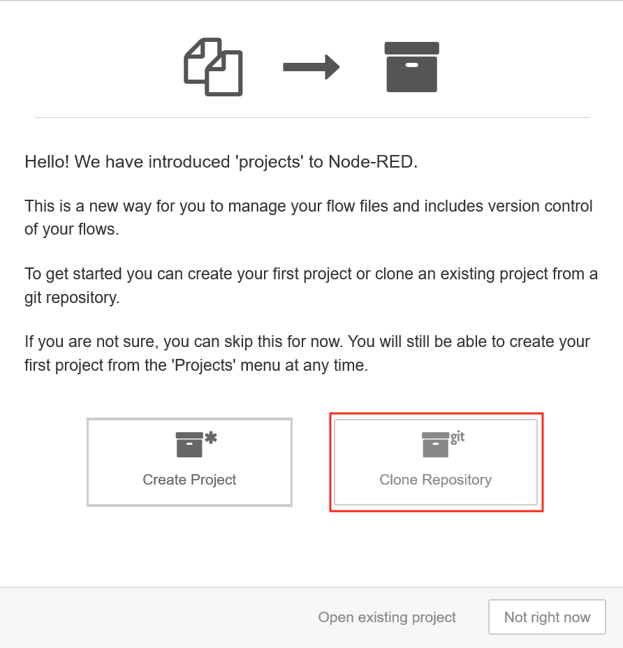{style="width: 50%" .center}
2. Select the Clone Repository.
    * Enter your name and email, to be used when committing content.
    * copy the Git repo URL from **your** git repo github page (the URL should contain your github user name):  
      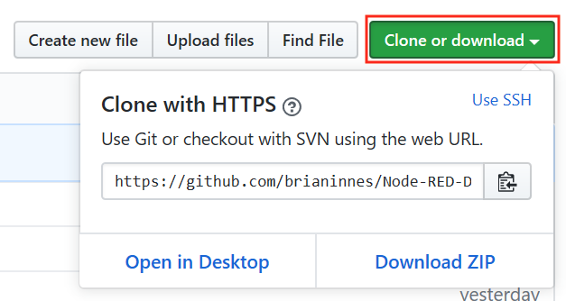{style="width: 50%" .center}
    * Back in the Node-RED editor window, paste the github URL into the **Git repository URL** field.
    * Enter your git credentials for the Username and Password fields (use the Personal Access Token as the password if you have one set on your github account - your github account password will not work if a personal access token is defined) then press the **Clone project** button when all the details have been completed - leave the Credentials encryption key field blank  
      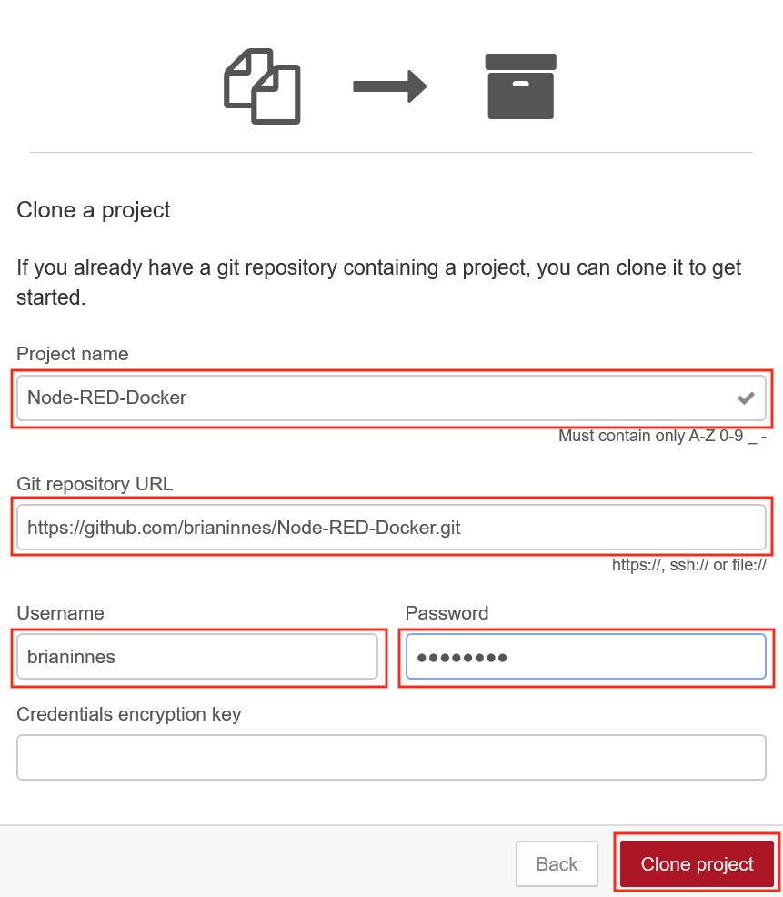{style="width: 50%" .center}  
      *Note: Leaving the **credentials encryption key** field blank means that any credentials entered in any node configuration will be checked into git unencrypted.  For this tutorial this isn't an issue as we want to go look at the credentials.  For your own projects you may want to enter an encryption key, unless you plan to provide all credentials at run time and want to inspect the credentials file to verify there are no captured credentials.*
3. Drag an inject and debug node onto the sheet and connect them to create a basic flow then deploy the changes  
  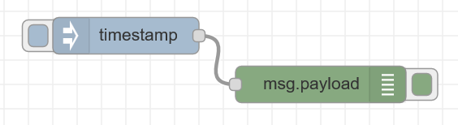{style="width: 50%" .center}
4. Switch to the project history section in the side panel, where you can see the flows.json file has uncommitted local changes.  Move your mouse over the entry and press the **+** button to stage the change  
    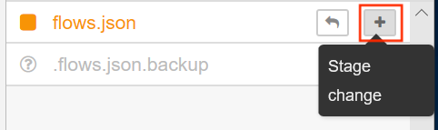{style="width: 35%" .center}
5. The flows.json file is now ready to be committed.  Press the commit button then enter a commit message **basic flow** to commit the flow change  
  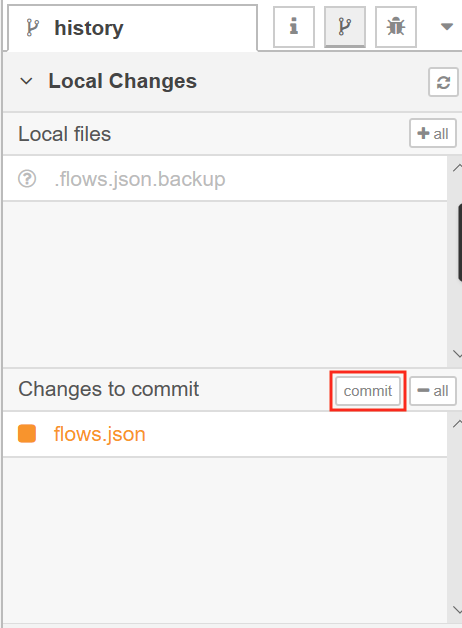{style="width: 35%" .center}
6. Switch to the **Commit History** section of the project side panel.  Here you can see the last commit and also that the local git branch is 1 commit ahead of the remote master.  Click the up arrow to open the Manage remote branch panel  
  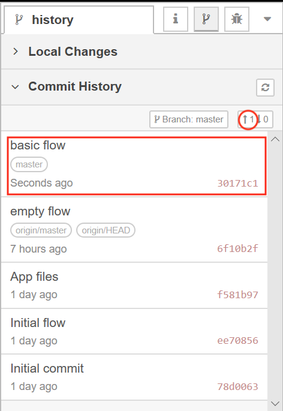{style="width: 35%" .center}
7. Press the **Push** button to send the commit to the remote branch  
  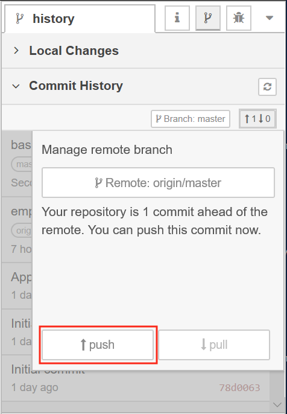{style="width: 35%" .center}

**Note**: There is an issue when running on Windows 10 - the git push is not always passing the git credentials correctly.  If this is the case you can issue a `git push` command from a command window.  Change to the active git project directory : \\[*user home directory*]\\NRdata\\projects\\[*repo name*] then issue the git push command.

### Step 4. Pulling changes and handling merge conflicts

You can also pull changes from the repo, so if a team is working on the same Node-RED application they can push their individual changes and the other team members can pull the changes.  

It is recommended that team members use different tabs in the Node-RED editor when collaborating to avoid merge conflicts, but if a merge conflict does occur, then it can be resolved within the Node-RED editor.

Follow the instructions below to cause a merge conflict then resolve it.

1. In the [GitHub web UI](https://github.com) open your forked project then open the flows.json page
2. Select the pencil icon to start editing the file  
    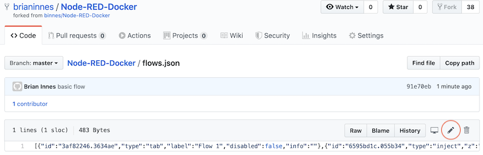
3. Find the x and y coordinates of the inject node and modify them, add or remove 10 to each of the values for x and y  
    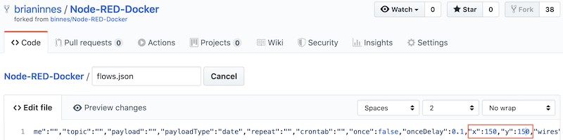
4. Press the **Commit changes** to save the change and commit the change to the master branch of the GitHub repo.  
    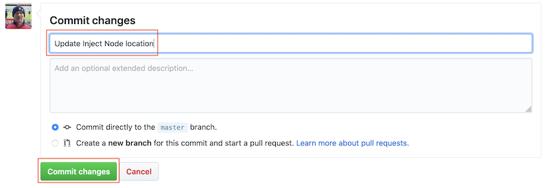
5. Back in the Node-RED editor move the inject node to a new location, then press the **Deploy** button to make the change live.
6. Open the git section of the side panel then stage and commit the update to the flow.
7. Open up the Commit History section and refresh the panel.  You will now see 1 change to push and 1 change to pull.  
    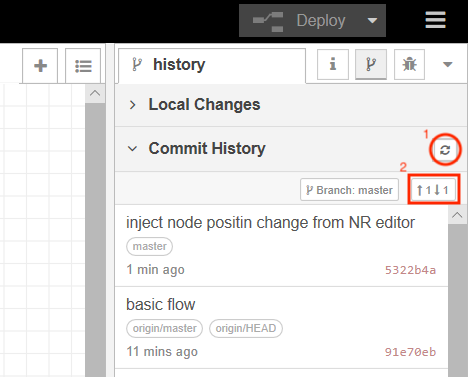{style="width: 35%" .center}
8. Clicking to manage the remote branch you will see the pull button enabled, select the pull button to bring in the change you made directly in GitHub  
    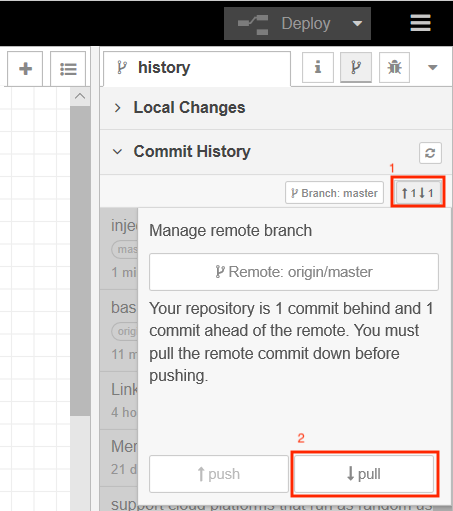{style="width: 35%" .center}
9. You should get a notification that automatic merging failed - which is expected as the GitHub change and your local change in the Node-RED editor made different changes to the same node.  Select the **Show merge conflicts** button in the notification window  
    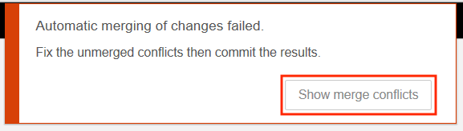{style="width: 35%" .center}
10. There is now a new section in the git panel - **Unmerged changes**.  Click the flow.json file to open the resolve conflicts window, highlighting where the conflicts are.  
    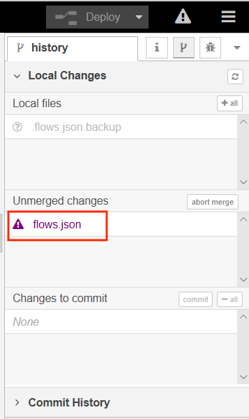{style="width: 35%" .center}
11. Expand the twisties until you can see the conflicting positions for the inject node.  You will also notice a radio button allowing you to select which version of the conflicting changes you want to accept.  
    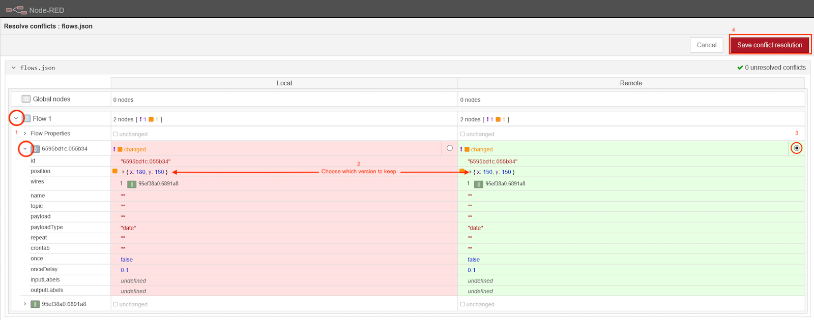
12. Select one of the versions by clicking the radio button.  The version which will be saved is highlighted in green and the version that will be overwritten is highlighted in red.  When all conflicts have been resolved click the **Save conflict resolution** button.
13. There is a new change to commit - this is the merge resolution commit.  Commit the change then navigate to the Commit History section of the Git side panel.  Here you will see there are no incoming changes, but there are 2 outgoing changes.  The original committed change and the merge resolution change.  Select **Manage remote branch** then push the changes.  
    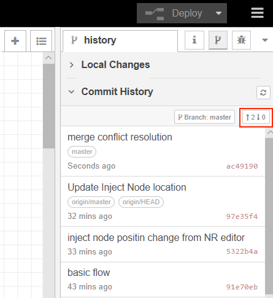{style="width: 35%" .center}

## Useful Docker command

Here are a few useful Docker commands:

* `docker ps -a` : list all containers (running and stopped)
* `docker stop mynodered` : will stop the container instance named **mynodered**, but leave the container resources intact
* `docker start mynodered` : will start a stopped container instance named **mynodered**
* `docker rm mynodered` : will remove all resources for container instance named **mynodered**.  The container instance must be stopped before it can be removed

You can remove the **mynodered** container instance without loosing any data, as the docker run command mapped the **NRdata** directory into the container, so all Node-RED data has been persisted in that directory, outside the container.  

## Summary

In this tutorial you:

* Enabled the projects feature in the Node-RED editor to provide integration with Git version control systems
* Cloned a GitHub project from within the Node-RED editor
* Committed and pushed changes to GitHub
* pulled changes from GitHub and resolved a merge conflict within the Node-RED editor

You can now work with Node-RED in a team environment synchronising via a Git repository, ensuring all changes to your Node-RED applications are version controlled.

Move onto the [next tutorial](../Packaging-Node-RED-apps-in-containers/README.md), where you will learn how to package your application into a container.
